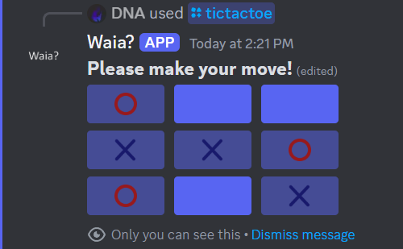
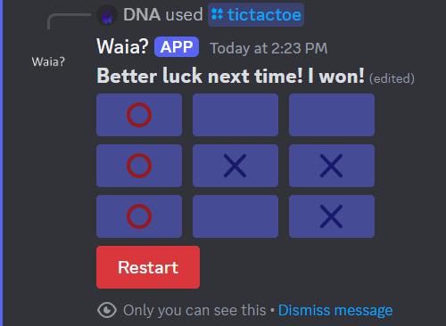
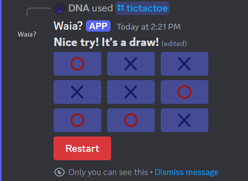

# Discord TicTacToe Bot by DNA

This is a simple TicTacToe bot for Discord made using [discord.js](https://discordjs.guide). For the board, I used Discord's Buttons and Message Components.

## Screenshots

## Setup

1. Clone the repository
2. Install [Deno](https://deno.com/)
3. Rename `env.template` to `.env` and fill in the required fields
4. Run `deno run -A main.ts`